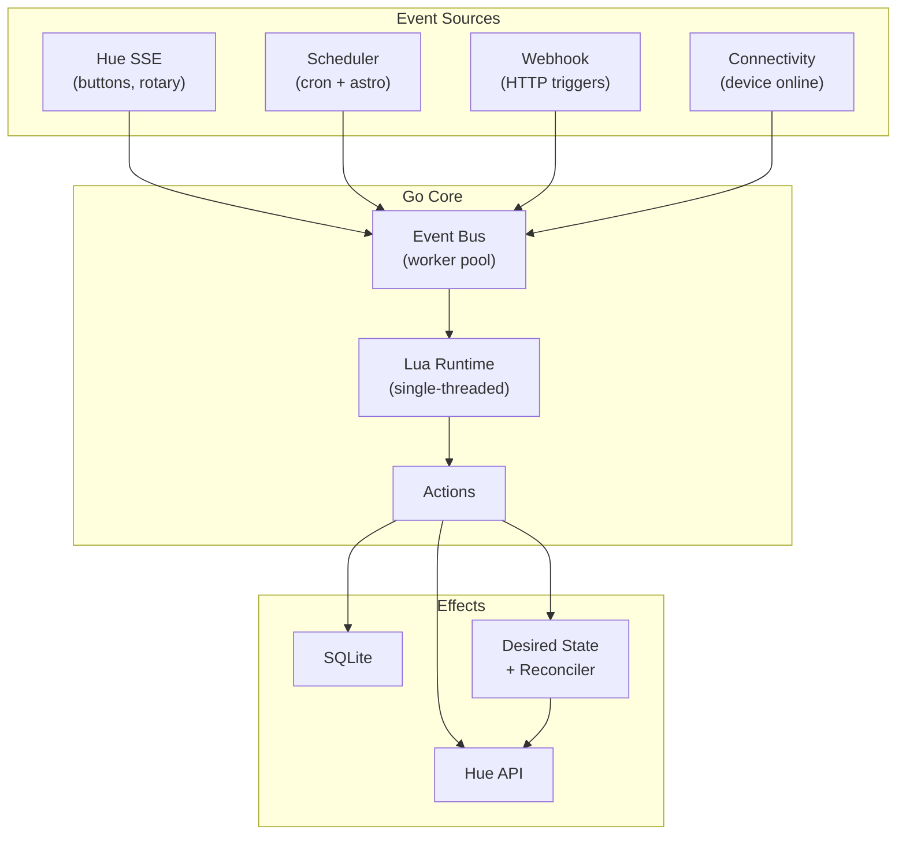

# Lightd

[](LICENSE)
[](go.mod)
[](https://github.com/dokzlo13/lightd/releases)

> The most overengineered way to turn on your lightbulb

Lightd is a **Philips Hue automation daemon** that lets you program your lights. It combines a robust Go core (event handling, persistence, scheduling, rate limiting) with a **Lua scripting layer** where you write your actual automation logic.

```lua
local action  = require("action")
local sse     = require("events.sse")
local webhook = require("events.webhook")
local sched   = require("sched")
local hue     = require("hue")
local utils   = require("utils")

-- React to button press: toggle lights with time-appropriate scene
sse.button("my-button-id", "short_release", "toggle_lights", {})
action.define("toggle_lights", function(ctx, args)
    local group, _ = hue.group("1")
    if group:any_on() then
        group:off()
    else
        group:set_scene("Relax"):on()
    end
end)

-- HTTP webhook: POST /rainbow to cycle colors
webhook.define("POST", "/rainbow", "run_rainbow", {})
action.define("run_rainbow", function(ctx, args)
    local group, _ = hue.group("1")
    local colors = {
        {0.68, 0.31}, {0.17, 0.70}, {0.15, 0.06},  -- red, green, blue
        {0.58, 0.38}, {0.44, 0.52}, {0.31, 0.32},  -- yellow, orange, purple
    }
    for _, xy in ipairs(colors) do
        group:set_color(xy[1], xy[2])
        utils.sleep(500)
    end
    group:set_scene("Relax")  -- restore
end)

-- Schedule scene changes based on astronomical time
sched.define("evening", "@sunset - 30m", "set_scene", { scene = "Relax" })
sched.define("night",   "23:00",         "set_scene", { scene = "Nightlight" })
```

---

## Key Ideas

- **Code as configuration**: Your automation logic lives in a Lua script. When requirements get complex, you have a real programming language with variables, functions, conditionals, and loops.

- **Event-driven architecture**: All inputs (button presses, rotary dials, scheduled times, webhooks, device connectivity) flow through a unified event bus and trigger Lua actions.

- **Single-threaded Lua**: All Lua code runs on a dedicated worker goroutine. No concurrency bugs in your scripts - the core handles parallelism, Lua stays simple.

- **Persistence across restarts**: Schedules, state, and key-value data survive restarts via SQLite. Missed schedules are recovered on boot.

---

## Why / Why Not

**Lightd might be for you if:**

- ✅ **Self-sufficient**: Lightd can drive your entire Hue lighting automation. No Home Assistant or other platforms required - just a Hue bridge and somewhere to run a container.
- ✅ **Hue-focused**: Built specifically for Philips Hue. It speaks the Hue API natively (v1 for control, v2 SSE for events).
- ✅ **Programmable**: When declarative configs hit their limits, you have a real language. Conditions, loops, state machines - whatever you need.

**Lightd is probably not for you if:**

- ❌ **Not an SDK or CLI**: This isn't a library for building Hue apps or a command-line tool. It's a daemon that runs your automation script continuously.
- ❌ **DIY required**: You need to manage your own configuration. Lightd won't discover your lights or generate configs for you - you need to know your group IDs, button resource IDs, and scene names.
- ❌ **Hue only**: If you need to control non-Hue devices, you'll need to integrate via webhooks or run something else alongside.

**Project status:**

- 🚧 **Early stage**: Not all Hue features are covered. I focused on my own use cases (groups, scenes, buttons, rotary). Contributions are welcome!
- 🤖 **Vibe-coded**: This project was built with help from LLM coding agents. While I do quality control, some code may be unconventional or contain bugs. PRs and issues appreciated.

---

## Architecture Overview



### Event Sources

- **Hue SSE**: Real-time events from the Hue bridge (button presses, rotary dial turns, device connectivity changes, light state changes)
- **Scheduler**: Time-based triggers with astronomical time support (`@dawn`, `@sunset`, etc.) and fixed times
- **Webhook**: HTTP endpoints for external integrations
- **Connectivity**: Device online/offline events for state recovery

### Core Components

- **Event Bus**: Bounded worker pool that dispatches events to handlers. Non-blocking with backpressure. Configurable workers and queue size.
- **Lua Runtime**: Single-threaded executor for all Lua code. Actions are queued and processed sequentially - no race conditions in your scripts.
- **Scheduler**: Manages schedule definitions with astronomical time expressions (`@dawn`, `@sunset + 1h`). Handles boot recovery - missed schedules are replayed on startup (grouped by tag, most recent wins).
- **SSE Client**: Maintains persistent connection to Hue bridge with exponential backoff reconnection.
- **Health Endpoints**: HTTP endpoints (`/health`, `/ready`) for container orchestration and monitoring.
- **Persistence (SQLite)**:
  - **KV storage**: User-accessible key-value store for Lua scripts
  - **Event ledger**: Append-only log for schedule deduplication and action completion tracking (with configurable retention)
  - **Desired state**: Versioned state store for reconciler (survives restarts)
  - **Geocache**: Cached coordinates for astronomical time calculations
- **Two control modes**:
  - *Immediate mode* (`hue.group("1"):set_scene("Relax")`)  -  direct API calls, instant feedback, no persistence. Good for rotary dials, brightness adjustments, visual effects.
  - *Reconciled mode* (`ctx.desired:group("1"):on():set_scene("Relax")`)  -  declares desired state, persisted to SQLite. The reconciler compares actual vs desired, determines the minimal action (turn on with scene, apply scene, turn off, adjust brightness), and applies it with rate limiting. Survives restarts; handles reconnects and idempotency automatically.

### Lua Modules

| Module | Purpose |
|--------|---------|
| `action` | Define and run actions |
| `sched` | Schedule definitions and time-based triggers |
| `hue` | Direct Hue API access (lights, groups, scenes) |
| `events.sse` | Button, rotary, connectivity, light change handlers |
| `events.webhook` | HTTP webhook handlers |
| `kv` | Persistent key-value storage |
| `geo` | Astronomical time calculations |
| `log` | Structured logging |
| `collect` | Event aggregation middleware |
| `utils` | Utilities (sleep, etc.) |

For the complete Lua API reference, see [MANUAL.md](MANUAL.md).

---

## Quick Start with Docker

### Prerequisites

- **Philips Hue bridge** reachable from your network
- **Hue API token** (see [Hue developer documentation](https://developers.meethue.com/develop/get-started-2/))

### 1. Create your Lua script

```lua
-- lightd.lua
local action = require("action")
local sse = require("events.sse")
local sched = require("sched")
local hue = require("hue")
local log = require("log")

-- Toggle group on button press
sse.button("YOUR_BUTTON_ID", "short_release", "toggle", {})

action.define("toggle", function(ctx, args)
    local group, err = hue.group("1")
    if err then
        log.error("Failed to get group: " .. err)
        return
    end
    
    if group:any_on() then
        group:off()
        log.info("Lights off")
    else
        group:set_scene("Energize"):on()
        log.info("Lights on with Energize scene")
    end
end)

-- Change scene at sunset
sched.define("sunset_relax", "@sunset", "set_relax", {})

action.define("set_relax", function(ctx, args)
    local group, _ = hue.group("1")
    if group:any_on() then
        group:set_scene("Relax")
    end
end)

log.info("Lightd script loaded")
```

### 2. Create docker-compose.yml

```yaml
services:
  lightd:
    image: ghcr.io/dokzlo13/lightd:latest
    container_name: lightd
    restart: unless-stopped
    environment:
      HUE_BRIDGE: "192.168.1.100"       # Your Hue bridge IP (required)
      HUE_TOKEN: "your-api-token"       # Your Hue API token (required)
      TZ: "Europe/Amsterdam"            # Your timezone
      GEO_ENABLED: "true"               # Enable astronomical times
      GEO_LOCATION: "Amsterdam"         # City for sunrise/sunset calculation
      LOG_LEVEL: "info"
    volumes:
      - ./data:/app/data                # Persist SQLite database
      - ./lightd.lua:/app/config/lightd.lua
    ports:
      - "8080:8080"                     # Webhook endpoint (optional)
      - "9090:9090"                     # Health check
```

### 3. Run

```bash
docker-compose up -d
docker-compose logs -f
```

### Configuration

Lightd uses a YAML configuration file. See `config.example.yaml` for a complete example.

**Config file structure:**

```yaml
# =============================================================================
# HUE BRIDGE CONNECTION
# Required: IP address and API token for your Philips Hue bridge
# =============================================================================
hue:
  bridge: "192.168.1.100"     # Bridge IP address
  token: "your-api-token"     # API token (see Hue developer docs)
  timeout: "30s"              # HTTP request timeout

# =============================================================================
# DATABASE
# SQLite database for persistence (KV storage, ledger, desired state, geocache)
# =============================================================================
database:
  path: "./lightd.sqlite"

# =============================================================================
# LOGGING
# Configure log output format and verbosity
# =============================================================================
log:
  level: "info"               # debug, info, warn, error
  use_json: false             # JSON format (recommended for production)
  colors: true                # Colorize text output (ignored if use_json=true)

# =============================================================================
# RECONCILER
# Manages desired state and applies changes to the bridge
# Disable if you only use immediate mode (hue.group():on())
# =============================================================================
reconciler:
  enabled: true               # Set false to disable reconciler entirely
  periodic_interval: 0        # Periodic reconciliation (0 = only on-demand)
  debounce_ms: 0              # Delay before reconciliation (0 = immediate)
  rate_limit_rps: 10.0        # Hue API rate limit (bridge allows ~10 req/sec)

# =============================================================================
# LEDGER
# Append-only event log for schedule deduplication and action tracking
# Prevents duplicate schedule runs after restarts
# =============================================================================
ledger:
  enabled: true               # Set false to disable (schedules may re-run)
  retention_period: "72h"     # How long to keep entries
  retention_interval: "24h"   # How often to clean old entries

# =============================================================================
# HEALTH CHECK
# HTTP endpoints for container orchestration (/health, /ready)
# =============================================================================
healthcheck:
  enabled: true
  host: "0.0.0.0"
  port: 9090

# =============================================================================
# EVENT BUS
# Internal event routing with bounded worker pool
# =============================================================================
eventbus:
  workers: 4                  # Parallel event handlers
  queue_size: 1024            # Events dropped if queue is full

# =============================================================================
# KV STORAGE
# Persistent key-value storage for Lua scripts
# =============================================================================
kv:
  cleanup_interval: "5m"      # How often to remove expired keys

# =============================================================================
# EVENT SOURCES
# Enable/disable different event inputs
# =============================================================================
events:
  # ---------------------------------------------------------------------------
  # WEBHOOK SERVER
  # HTTP server for external integrations (curl, Home Assistant, etc.)
  # ---------------------------------------------------------------------------
  webhook:
    enabled: true             # Set false to disable webhook server
    host: "0.0.0.0"
    port: 8081

  # ---------------------------------------------------------------------------
  # HUE SSE (Server-Sent Events)
  # Real-time events from the Hue bridge (buttons, rotary, connectivity)
  # Reconnects automatically with exponential backoff on connection loss
  # ---------------------------------------------------------------------------
  sse:
    enabled: true             # Set false to disable SSE (no button events!)
    min_retry_backoff: "1s"   # Initial retry delay after disconnect
    max_retry_backoff: "2m"   # Maximum retry delay (caps exponential growth)
    retry_multiplier: 2.0     # Backoff multiplier (delay *= multiplier each retry)
    max_reconnects: 0         # 0 = infinite reconnection attempts

  # ---------------------------------------------------------------------------
  # SCHEDULER
  # Time-based triggers with optional astronomical time support
  # ---------------------------------------------------------------------------
  scheduler:
    enabled: true             # Set false to disable all schedules
    geo:
      enabled: true           # Enable astronomical times (@sunrise, @sunset)
      use_cache: true         # Cache geocoded coordinates in SQLite
      name: "Amsterdam"       # City name for geocoding (uses Nominatim API)
      timezone: "Europe/Amsterdam"
      http_timeout: "10s"     # Timeout for geocoding HTTP requests
      # lat: 52.3676          # Optional: provide coords to skip geocoding
      # lon: 4.9041

shutdown_timeout: "5s"        # Graceful shutdown timeout

# =============================================================================
# LUA SCRIPT
# Path to your automation script
# =============================================================================
script: "main.lua"

```

**Docker environment variables:**

The Docker image maps environment variables to config values. All variables are optional except `HUE_BRIDGE` and `HUE_TOKEN`.

| Variable | Description | Default |
|----------|-------------|---------|
| `HUE_BRIDGE` | Hue bridge IP address | *required* |
| `HUE_TOKEN` | Hue API token | *required* |
| `HUE_TIMEOUT` | HTTP timeout for Hue API | 30s |
| `TZ` | Timezone | - |
| `SCRIPT_PATH` | Path to Lua script | /app/config/lightd.lua |
| `DATABASE_PATH` | SQLite database path | /app/data/lightd.sqlite |
| `LOG_LEVEL` | Log level (debug/info/warn/error) | info |
| `LOG_JSON` | JSON log format | true |
| `LOG_COLORS` | Colorize output (ignored if JSON) | false |
| `GEO_ENABLED` | Enable astronomical times | false |
| `GEO_LOCATION` | City name for geocoding | - |
| `GEO_LAT` | Latitude (skip geocoding) | - |
| `GEO_LON` | Longitude (skip geocoding) | - |
| `GEO_USE_CACHE` | Cache geocoded coordinates | true |
| `GEO_HTTP_TIMEOUT` | Geocoding API timeout | 10s |
| `SSE_ENABLED` | Enable Hue SSE event stream | true |
| `SSE_MIN_RETRY_BACKOFF` | Initial retry delay after disconnect | 1s |
| `SSE_MAX_RETRY_BACKOFF` | Maximum retry delay | 2m |
| `SSE_RETRY_MULTIPLIER` | Backoff multiplier | 2.0 |
| `SSE_MAX_RECONNECTS` | Max reconnect attempts (0=infinite) | 0 |
| `WEBHOOK_ENABLED` | Enable webhook HTTP server | true |
| `SCHEDULER_ENABLED` | Enable time-based scheduling | true |
| `RECONCILER_ENABLED` | Enable state reconciler | true |
| `RECONCILER_INTERVAL` | Periodic reconciliation (0=disabled) | 0 |
| `RECONCILER_DEBOUNCE_MS` | Delay before reconciliation (ms) | 0 |
| `RECONCILER_RATE_LIMIT` | Hue API rate limit (req/sec) | 10.0 |
| `EVENTBUS_WORKERS` | Event processing workers | 4 |
| `EVENTBUS_QUEUE_SIZE` | Event queue size | 100 |
| `LEDGER_ENABLED` | Enable event ledger | true |
| `LEDGER_RETENTION_PERIOD` | Ledger entry retention | 72h |
| `LEDGER_RETENTION_INTERVAL` | Ledger cleanup interval | 24h |
| `KV_CLEANUP_INTERVAL` | KV expired entry cleanup | 5m |
| `SHUTDOWN_TIMEOUT` | Graceful shutdown timeout | 5s |

See [`config.docker.yaml`](./config.docker.yaml) for the full mapping.

---

## Building from Source

```bash
git clone https://github.com/dokzlo13/lightd.git
cd lightd
go build -o lightd ./cmd/lightd
./lightd -config config.yaml
```

Requires Go 1.24+ and CGO (for SQLite).

---

## Why Lightd Exists

### The Problem

I purchased Philips Hue lights for circadian lighting - I wanted warm light in the evening and energizing light in the morning, automatically adjusted based on time of day.

The official Hue app has "Natural Light" routines, but they break when you manually control lights. Turn off the lights at night, and the next morning they turn on with last night's "Nightlight" scene instead of the appropriate morning scene.

I wanted lights that **always** activate with the correct scene for the current time of day.

### Why Not Home Assistant?

I don't run a full home automation stack. I just wanted smart lights that work correctly. Setting up Home Assistant, learning its YAML syntax, and maintaining another service felt like overkill for my use case.

So I wrote my own solution.

### First Attempt: hueplanner (Python + YAML)

My first attempt, [hueplanner](https://github.com/dokzlo13/hueplanner), used Python with YAML configuration. It worked initially, but as requirements grew, the YAML became unwieldy:

```yaml
# This started simple...
schedules:
  - time: "@sunset"
    action: set_scene
    scene: Relax

# ...but adding conditions, variables, and complex logic
# turned it into a custom DSL nightmare
```

YAML is great for data, but once you need conditions, loops, and functions, you're building a worse programming language inside a configuration format.

### Lightd: Code as Configuration

Lightd takes the opposite approach: instead of making YAML more powerful, it uses Lua - a real programming language - for automation logic.

The Go core handles the hard problems:
- Event stream management with reconnection
- Rate limiting for Hue API
- Persistence and crash recovery
- Concurrent event processing
- Astronomical time calculations

The Lua script handles the easy part:
- What should happen when a button is pressed
- Which scenes apply at which times
- Any custom logic you can imagine

---

## License

MIT
