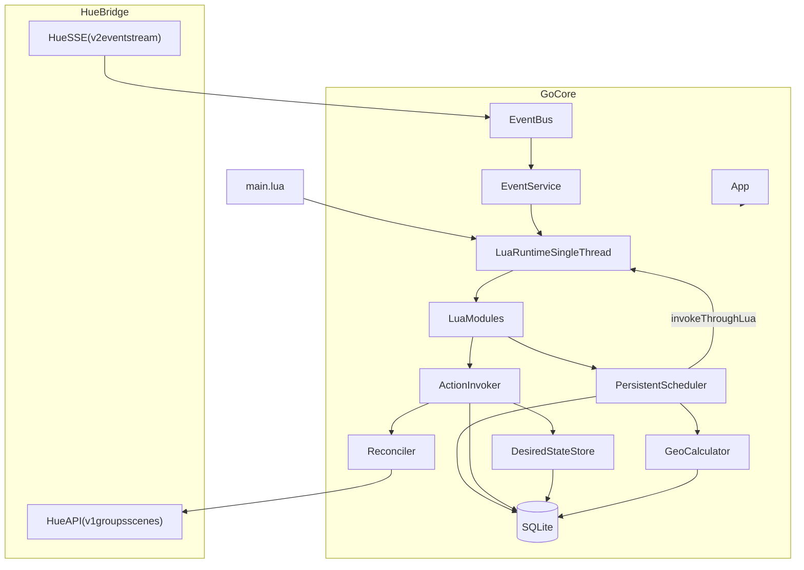
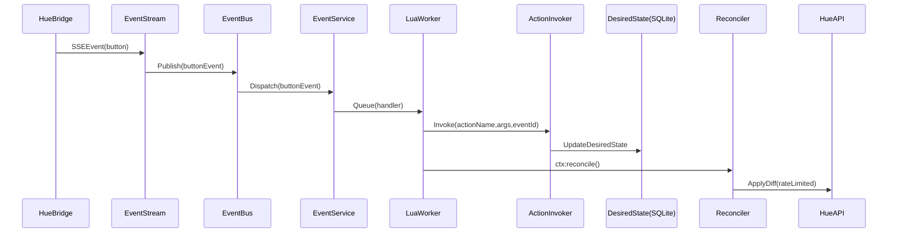
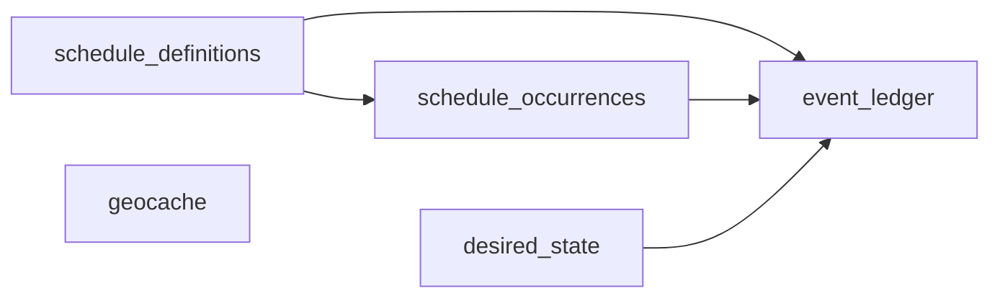

# Lightd

> The most overengineered way to turn on your lightbulb

[](LICENSE)
[](go.mod)
[](https://github.com/dokzlo13/lightd/releases)
[](https://github.com/dokzlo13/lightd/commits)

Lightd is a **Philips Hue automation daemon**: a small Go core (persistence, scheduling, event ingestion, reconciliation) plus a **Lua policy layer** (your actual "configuration", written as code).

It's meant to feel like a tiny, purpose-built automation runtime:

- define time phases (including dawn/noon/sunset offsets)
- react to Hue buttons and rotary events
- repair state after reconnects (reconciliation)
- keep schedules durable across restarts (SQLite)

This is the successor to my original Python/YAML project: [`dokzlo13/hueplanner`](https://github.com/dokzlo13/hueplanner).

---

## Key ideas (how Lightd thinks)

- **Policy vs mechanism**: You write *policy* in Lua; the daemon provides the *mechanism* (scheduler, persistence, Hue IO).
- **Desired state + reconciliation**: actions write desired state; a reconciler applies the minimal diff to the bridge.
- **Idempotent execution**: schedules and device events get stable IDs so restarts don't cause duplicate actions.
- **Single-threaded Lua**: all Lua runs through one worker to keep it safe and simple.

---

## Architecture

### Components



### Event flow (what happens on a button press)



---

## Quick start

### Prerequisites

- **Philips Hue bridge** reachable from the machine running Lightd.
- A **Hue API key / application token** (keep it secret). The README intentionally does not duplicate the steps; refer to Philips Hue official documentation.
- **Go 1.24+** (see `go.mod`).

### Build

```bash
git clone git@github.com:dokzlo13/lightd.git
cd lightd
go build -o lightd ./cmd/lightd
```

### Configure

Create your own `config.yaml` and adjust:

```yaml
hue:
  bridge: "192.168.10.12"
  token: "${HUE_TOKEN:replace-me}"
  timeout: "30s"

  # Event stream reconnect policy
  min_retry_backoff: "1s"
  max_retry_backoff: "2m"
  retry_multiplier: 2.0
  max_reconnects: 0

geo:
  name: "Espoo, Finland"
  timezone: "Europe/Helsinki"
  http_timeout: "10s"
  # Optional: lat/lon to avoid external geocoding
  # lat: 60.2055
  # lon: 24.6559

database:
  path: "./hueplanner.sqlite"

log:
  level: "${LOG_LEVEL:info}"
  colors: true
  print_schedule: "30m"

cache:
  enabled: false               # Currently not wired (reserved); cache TTL is controlled by refresh_interval
  refresh_interval: "5m"       # Group state cache TTL

reconciler:
  periodic_interval: "5m"
  rate_limit_rps: 10.0

ledger:
  cleanup_interval: "24h"
  retention_days: 3

healthcheck:
  enabled: true
  host: "0.0.0.0"
  port: 9090

eventbus:
  workers: 4
  queue_size: 100

shutdown_timeout: "5s"
script: "main.lua"
```

### Run

```bash
./lightd -config config.yaml
```

Useful flags:

- `-config`: path to config file (default: `config.yaml`)
- `--reset-state`: clears stored desired state (bank scenes) on startup

Health endpoints (when enabled):

- `GET /health`
- `GET /ready`

---

## Lua scripting model

### Environment variable substitution in YAML

Anywhere in `config.yaml` you can use `${VAR}` or `${VAR:default}`. Example:

```yaml
hue:
  token: "${HUE_TOKEN:replace-me}"
log:
  level: "${LOG_LEVEL:info}"
```

Your Lua script is the *behavior*. It does two things:

1. **Defines schedules** (stable rules stored in SQLite)
2. **Registers event handlers** (Hue button/rotary/connectivity events)

### Modules available to Lua

| Module | What it is for | Main functions |
|---|---|---|
| `sched` | Persistent schedules | `define`, `run_closest`, `enable`, `disable`, `print` |
| `input` | Event handler wiring | `button`, `button_toggle`, `rotary`, `connectivity` |
| `action` | Define actions | `define`, `define_stateful` |
| `geo` | Astronomy helpers | `today` |
| `hue` | Direct Hue calls (imperative helpers) | `cache.group`, `set_group_brightness`, `adjust_group_brightness`, `get_group_brightness`, `recall_scene` |
| `log` | Structured logs | `debug`, `info`, `warn`, `error` |

### Actions and the action context (`ctx`)

Every action receives a `ctx` and `args`:

- `ctx.actual:group(groupId) -> (stateTable, err)`
  - stateTable: `{ all_on = bool, any_on = bool }`
- `ctx.desired:set_bank(groupId, sceneName)`
- `ctx.desired:set_power(groupId, boolean)`
- `ctx.desired:get_bank(groupId) -> sceneNameOrNil`
- `ctx:reconcile()` triggers reconciliation

### Scheduler time expressions

Schedule definitions use a small expression language:

- Fixed time: `"22:15"`
- Astronomical base times: `@dawn`, `@sunrise`, `@noon`, `@sunset`, `@dusk`
- Optional offsets: `@sunset - 30m`, `@noon + 1h30m`

Notes:

- In polar regions, if an astronomical event does not exist that day, that occurrence is skipped.
- Special DST policies are not implemented yet (fixed times behave like standard `time.Date` in the configured timezone).

---

---

## Persistence model (SQLite)

Lightd persists both "what should happen" and "what has happened".



Tables (high level):

- `schedule_definitions`: stable schedule rules defined from Lua via `sched.define(...)`
- `schedule_occurrences`: computed "next" occurrences cache
- `event_ledger`: append-only history for dedupe, restart recovery, auditing
- `desired_state`: per-group desired state (bank scene + desired power), versioned for dirty tracking
- `geocache`: cached geocoding lookups (so Nominatim is not called every run)

---

## Reliability semantics (the stuff that makes it safe)

### Idempotency

Lightd deduplicates by **idempotency key**:

- **Scheduled actions**: key is the occurrence ID (`defId/unixTimestamp`)
- **Hue button events**: key is derived from resource ID + event timestamp from SSE
- **Manual calls**: empty key means "always run" (no dedupe)

### Crash / restart recovery

For stateful actions, Lightd writes an `action_started` ledger entry containing the **captured decision** (derived from actual state). If the process dies mid-flight, the invoker finds the orphaned start and **replays** the captured decision.

### Misfires

If the app was down when an occurrence should have fired, each schedule has a `misfire_policy`:

- `skip`
- `run_latest` (default)
- `run_all`

---

## Operations & troubleshooting

### Inspect the schedule

Lightd periodically prints the formatted schedule (interval controlled by `log.print_schedule`).

You can also call from Lua:

```lua
local sched = require("sched")
sched.print()
```

### Inspect state and history

Everything important is in SQLite:

- `desired_state` shows what Lightd currently wants
- `event_ledger` shows what ran (and why it was deduped / recovered)
- `schedule_definitions` shows the rules defined by Lua

### Reset behavior

If your desired "bank" got into a weird state after changing scripts:

```bash
./lightd -config config.yaml --reset-state
```

---

## Why I made this (motivation)

Smart lights are "simple" until you try to make them **predictable** across real life:

- circadian schedules based on sunrise/sunset
- physical buttons that should "do the right thing" no matter the time of day
- devices that drop off the mesh and come back in a weird state

For me, the trigger was circadian lighting in a place with dramatic seasons: in winter everything is dark early, in summer the sun barely sets. I wanted a setup where "daylight" phases are **computed** (dawn/noon/sunset, with offsets) and the buttons always map to "current phase", instead of getting stuck on whatever scene happened to be active last.

As the automation grew to include **time-based rules + hardware events + connectivity events (and potentially webhooks)**, the system stopped being a static configuration problem and became a **dynamic system** problem.

This is why Lightd uses a split:

- A **stable core** that is good at the hard problems (persistence, idempotency, recovery, rate limiting, concurrency)
- A **scripting layer** that stays ergonomic as the behavior becomes more complex

In other words: when the world is dynamic, the "configuration" eventually becomes a program. Lightd embraces that explicitly, while keeping the unsafe parts boxed into a small, testable core.

---

## Why I migrated from Python + YAML to Go + Lua (and changed the architecture)

The original system started as "just a scheduler", but it naturally evolved into a **rules engine**. That's not a failure of the YAML approach - it's what happens when you pile real-world requirements onto home automation.

### Why a compiled core (Go) helps

- **Smaller footprint & simpler ops**: a single static-ish binary is easier to deploy and typically uses less memory than a full Python runtime + dependencies.
- **Concurrency model that fits the problem**: long-lived SSE streams, retries/backoff, background loops, and rate-limited IO are straightforward in Go.
- **Hard guarantees**: it's easier to make persistence/idempotency/recovery "always on" infrastructure instead of "best effort glue".
- **Embedding a scripting VM is natural**: Go can host Lua cleanly while keeping all stateful side effects in the core.

### Why a YAML DSL bloats (and why it's not your fault)

Once you have:

- dynamic times (dawn/noon/sunset with offsets)
- day re-planning / recalculation
- persistent scheduling and dedupe
- multiple trigger sources (Hue button/rotary, reconnect/connectivity)
- "closest schedule" queries
- stateful toggles and fallbacks

…a declarative format starts needing variables, loops, functions, conditionals, modules, composition, and debugging tools. At that point **YAML becomes "a worse programming language"** and the complexity becomes unavoidable.

So the sane line is:

- **YAML for data** (infrastructure config: bridge address, timeouts, database path, log level)
- **Lua for logic** (behavior: schedules, actions, handlers, reuse)

### The architecture that stays sane: "event → state → effects"

The scalable mental model is to make everything the same shape:

1. **Events** come in (button/rotary press, connectivity change, scheduled occurrence due).
2. A pure-ish **update step** decides what the system wants to be true (update internal desired state).
3. An **effects step** performs side effects (Hue API calls via reconciliation, persistence/ledger updates).

This is basically the Elm/Redux idea applied to home automation - the big win is that "a lot of different hooks" stop being special cases. They're just different **event sources** feeding the same pipeline.

Concretely, you can treat inputs as one logical stream:

- Hue button/rotary → `EventBus(button|rotary, {resource_id, ...})`
- Hue connectivity → `EventBus(connectivity, {device_id, status})`
- Scheduler occurrence due → `Invoke(action, args, occurrence_id="def_id/unix")` (idempotent, ledger-backed)
- Astronomical times → evaluated on-demand from `@dawn/@sunrise/@noon/@sunset/@dusk` (scheduler) or `geo.today()` (Lua)

Lightd already follows this shape internally: Hue SSE publishes into the bus, `EventService` routes matching handlers onto the single Lua worker, actions update `desired_state`, and the reconciler applies effects to the bridge. Schedules are durable and invoke actions directly with stable occurrence IDs for dedupe.

### Durable schedule definitions instead of a “forever-schedule DSL”

If your schedule depends on day-specific inputs (astronomical times, offsets, seasons), trying to encode that logic into a declarative DSL is what causes the explosion.

A cleaner model (and what Lightd does today) is:

- Lua defines **durable schedule definitions** via `sched.define(id, time_expr, action_name, args, opts)`; definitions live in SQLite.
- The core scheduler computes the next **occurrence** for each enabled definition (using geo times when `time_expr` references `@dawn/@sunset/...`) and handles misfires on restart.
- At runtime, the scheduler sleeps until the next occurrence and invokes the target action (routed through the Lua worker for thread safety) with `occurrence_id = "def_id/unix"` as the idempotency key.

Even if you don't literally rebuild the whole day every night, this framing is useful: **code generates the day's intent**, the core runtime executes it reliably.

---

## License

MIT
